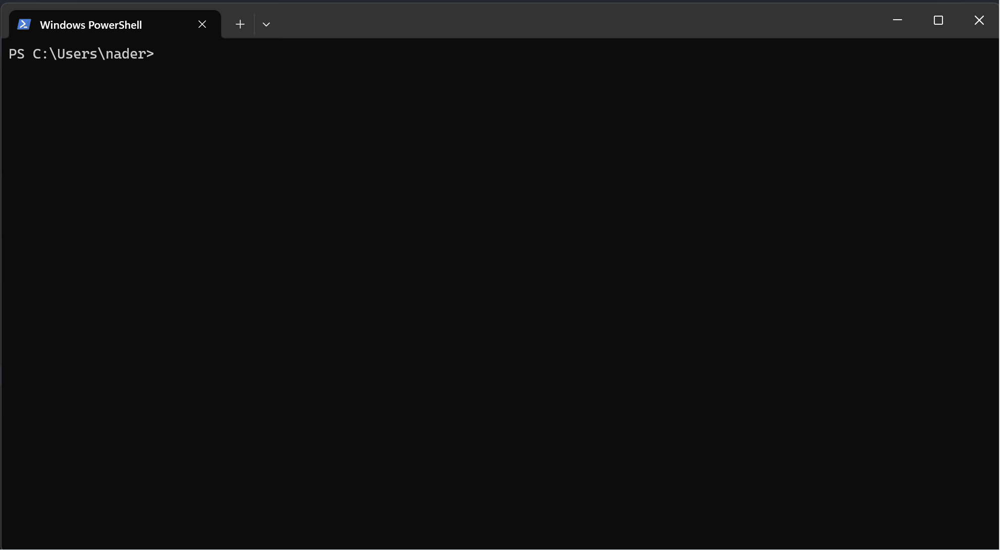

# WPA CLI Bug

To reproduce the bug just download the project, build and run it locally and check watch the output.

Project link: [https://github.com/nader-zouaoui/WPA-CLI-bug/tree/master](https://github.com/nader-zouaoui/WPA-CLI-bug/tree/master)

The project is a clean C# WPF project that has only one button when you click it it's supposed to call `wpa -listplugins` and print the output to the `Debug` output.

The `wpa` call was made using the `Process` class from C#, below is a snippet of how it was made:

```C#
        public static void StartMe()
        {
            Debug.WriteLine("I was called");
            try
            {
                using (Process myProcess = new Process())
                {
                    myProcess.StartInfo.UseShellExecute = false;
                    myProcess.StartInfo.FileName = "C:\\Program Files (x86)\\Windows Kits\\10\\Windows Performance Toolkit\\wpa.exe";
                    myProcess.StartInfo.CreateNoWindow = true;
                    myProcess.StartInfo.RedirectStandardOutput = true;
                    myProcess.StartInfo.RedirectStandardError = true;
                    myProcess.OutputDataReceived += MainWindow.p_OutputDataReceived;
                    myProcess.ErrorDataReceived += MainWindow.p_ErrorDataReceived;
                    myProcess.StartInfo.ArgumentList.Add("-listplugins");
                    myProcess.Start();
                    myProcess.BeginOutputReadLine();
                    myProcess.BeginErrorReadLine();
                    myProcess.WaitForExit();
                }
            }
            catch (Exception e)
            {
                Debug.WriteLine(e.Message);
            }
        }
```

## Expected behaviour

We are using the `Process` class to call the `wpa` cli with `-listplugins` argument to get the list of the plugin.
This whole process is triggered after clicking on a button using the `Click` Button attribute.
We expect the button to print the list of the available plugins to the Debug console.

## Observed behaviour

After clicking the button the UI is blocked and the `WPACall_Click` function keeps getting called over and over in a infinite loop


## Why this is happening (Speculative analysis)

I believe that the `wpa` CLI is sending a `ENTER` keystroke after exiting and since the button is on focuse it gets clicked again and the cycle keeps repeating.

## Other observed patterns

- After calling `wpa -listplugins` on the command line directly I saw that the shell is being released for a brief moment (where you can type other commands if you wish) and then when the result of `wpa -listplugins` is ready, it gets appended in the shell output.
  
- When we try to call that using the following pattern `cmd /c "wpa -listplugins"` we also realize that the result is printed and then an extra `ENTER` stroke is called
  

## A fix that reinforces the theory

If swap the `Click` attribute from the button to a `LeftMouseDown` attribute the bug disappears.

Also when logging the call stack frames we immidiatly see a small difference betweeen the original call (the one triggerd by my mouse click) and the looped calls (The one presumably triggered by the `ENTER` keystroke), We can see that the second call onwards are all being triggered by an `OnKeyDown` event rather than `OnLeftMouseUp` event.
